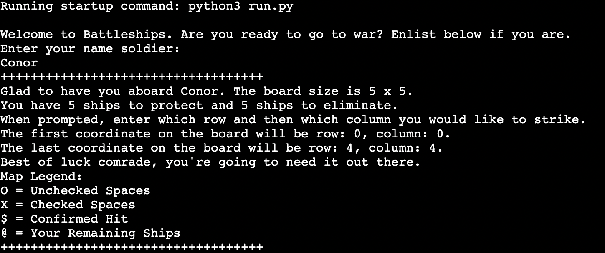
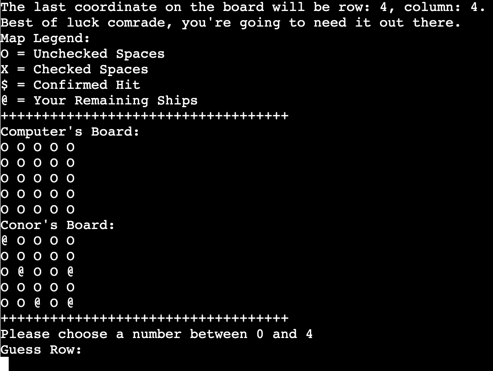
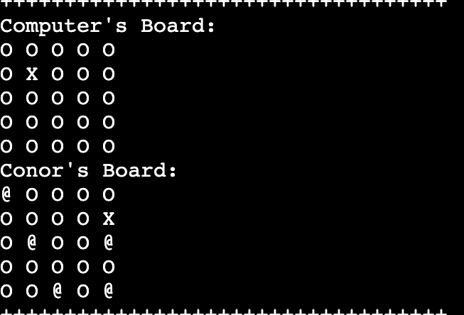
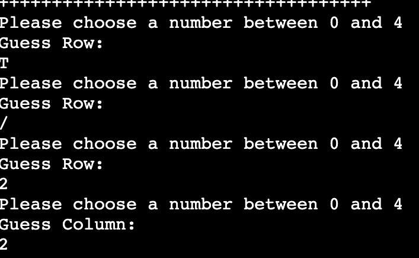

<h1 align="center">Battleships Game</h1>

---

[Live Website](https://battleships-conor.herokuapp.com/)

[Github Repository](https://github.com/conorwalsh1/battleships)

---

# About

Welcome to Battleships. Battleships is a Python terminal game which runs in the Code Institute mock terminal on Heroku.

Users play against a computer over a series of rounds to see who can find their opponents battleships first.

This website was built using a Macbook Pro 13".

## How To Play

Battleships is a game of chance where you aim to find all of your opponents ships before they find all of yours. You can read more about it here on [Wikipedia](https://en.wikipedia.org/wiki/Battleship_(game)battleships)

The player is prompted to enter their name, after which instructions are given and two boards are generated.

Player can see their ships idicated by the '@' symbol, but they cannot see where the computers ships are.

Guess are marked on board with an 'X', whilst hits are marked with a '$'.

Each new round allows player and computer to make a guess.

The game continues until one of the players sinks all of the others battleships.
    
## Features:

- Start up message that stores players name.

- Random board generation.

- Ships are randomly placed on both boards at the start of each round.

- Computer ships hidden from player.

- Accepts user input.

- Play against a computer.

- Alerts player when each ship has been hit how many are remaining on the board.

- Input validation - Players must enter a number within range of the board size and it must be a number, not a letter.

- Different messages generate at the end of the game, depending on if players wins or loses.

## Features To Add In Future

- Larger ships that are bigger than just 1x1 coordinate.

- Player allowed to decide where their ships are placed.

- Player allowed to set board size and amounts of ships.

## Data Model
 
 I decided to use a series of arrays as a data model for this project. I used arrays to store the coordinates on the board. I also used arrays to store the player and computer guesses which I utilised in different areas for example when checking for invalid inputs, I was able to check against what the computer had guessed already to make sure it chose a new coordinate each time.

 I also used arrays to hold the coordinates of the ships which the players then guessed with row and column. When the total amount of ships was brought to zero, a winner was then decided, be it player or computer.

### Languages Used

-    Python

## Testing

I have manually tested the project by doing the following:

- Passed code through PEP8  linter which confirmed there are no problems.

- Gave invalid inputs, such as numbers outside range and letters instead of numbers.

- Tested in my local terminal and the Code Institute Heroku terminal.

### Fixed Bugs

- Each new round was producing a brand new board with new coordinates as I was running the create_board function in my next_round function as opposed to printing the board.

- The game would not come to a close as I had entered the next_round function an extra time by mistake, thus causing new rounds to constantly be generated.

- The game was only storing one ship at a time, even though it would say there was three ships on the board. I found out through testing that I had not been storing the ships in a correct array, so the checks I was doing would only search for one coordinate at a time instead of two together. I created an if statement that would keep appending coordinates to the array, so as long as the same coordinates would not be generated twice, in which case it would stop appending.

- I encountered multiple errors in the problems section beside the terminal. The errors showing up were: lines too long, not enough whitespace between lines and extra white space at the end of lines.

- Another error thrown up was that i (which I had used in a for statement) had been created but not used, so I switched it out for a '_' instead.

### Remaining Bugs

-   There are no known bugs at this time.

## Deployment

This project was deployed using Code Institutes mock terminal for Heroku.

Deployment steps:

- Fork or clone this repository.

- Create a new Heroku app

- Set the buildbacks to Python and NodeJS in that order

- Link the Heroku app to the repository

- Click on deploy

### Content

-   Code Institute README.md template.

- Wikipedia for the details of the Battleships game.

-   All other content was written by Conor Walsh.

### Acknowledgements

-   I would like to thank my mentor Maria Hynes for guiding me along the right path throughout our mentoring sessions. There were times I struggled with getting the way I wanted the code to look out of my head and onto the screen, but she gave me great motivation to persevere and I am very grateful for her assistance. I would also like to thank the tutors that helped me along the way.